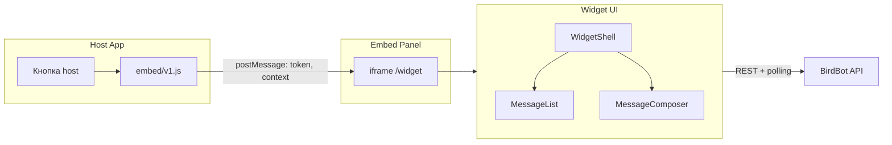
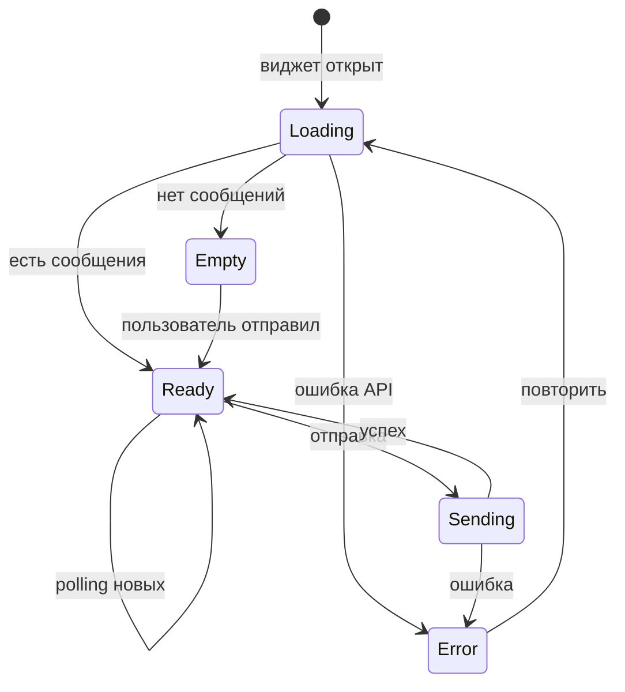
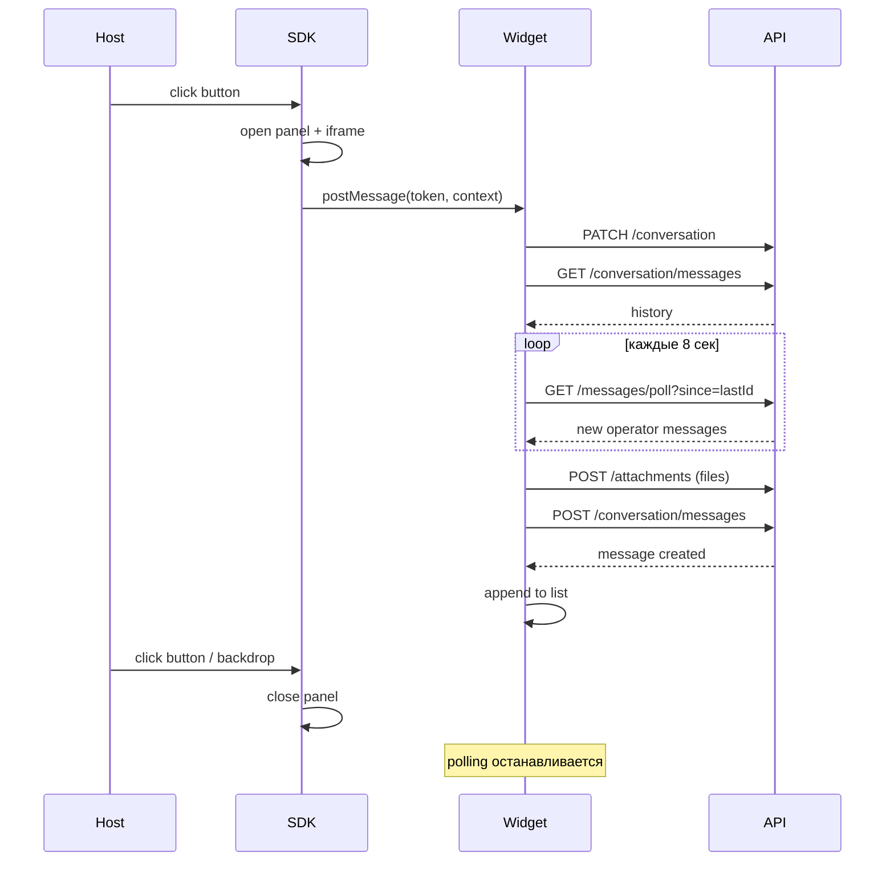

# BirdBot — спецификация v1.0

> Сервис встраиваемого чата поддержки.  
> Отдельный репозиторий, один npm-проект (TypeScript strict).  
> Один инстанс обслуживает одно host-приложение (конфиг в `.env`).

---

## 1. Назначение

BirdBot — embed-виджет чата, подключаемый в любое веб-приложение одной кнопкой.

**v1.0 умеет:**
- принимать сообщения и файлы от пользователя;
- хранить диалоги в MongoDB, файлы на диске;
- пересылать сообщения в общую Telegram-группу поддержки;
- принимать ответы оператора через reply в Telegram (текст + файлы/картинки);
- доставлять ответы пользователю в виджет через polling.

**Не входит в v1.0:** AI-агент, S3, привязка диалога к projectId, operator admin UI, WebSocket.

---

## 2. Принципы

| Принцип | Решение |
|---------|---------|
| Один инстанс | Одно host-приложение, конфиг в `.env` (`JWT_SECRET`, `DEMO_JWT`) |
| Один процесс | Express на одном порту: API + виджет + embed + demo |
| Один репозиторий | Один `package.json`, модули в `src/`, TypeScript strict |
| Один диалог | `(appId, externalUserId)` — один чат на пользователя |
| Идентификация | Только `externalUserId` из JWT (`decoded[jwtUserIdClaim]`) |
| CORS | Все origin разрешены; доступ к API защищён JWT |
| Telegram | Одна группа поддержки на инстанс |
| Polling TG | Long polling всегда, без webhook |
| Прокси TG | Если `TELEGRAM_PROXY_URL` задан — через прокси, иначе напрямую |
| Файлы | Диск, до 10 MB, любые типы; пересылка в TG и обратно |
| UI | Русский, antd; кнопку рисует host |
| Retention | Без ограничений |

---

## 3. Архитектура

```
┌── Host App ─────────────────────────────────────────────┐
│  Своя кнопка #birdbot-btn                               │
│  <script src="https://birdbot.databird.ru/embed/v1.js"> │
│  BirdBot.init({ button, getToken, getContext })         │
└────────────────────────┬────────────────────────────────┘
                         │ HTTPS
┌────────────────────────▼────────────────────────────────┐
│  birdbot.databird.ru  (один Express, порт 4100)         │
│  ├─ /embed/v1.js     → SDK, открывает iframe           │
│  ├─ /widget/         → React + antd UI (iframe)          │
│  ├─ /demo/           → демо host-приложение (dev)        │
│  └─ /api/v1/*        → REST API                         │
│       ├─ MongoDB                                          │
│       ├─ uploads/ на диске                                │
│       └─ Telegram polling worker                          │
└────────────────────────┬────────────────────────────────┘
                         │ long polling + sendMessage
                         │ (через прокси, если задан)
┌────────────────────────▼────────────────────────────────┐
│  Telegram: одна группа поддержки                        │
│  Оператор отвечает reply на сообщение бота              │
└─────────────────────────────────────────────────────────┘
```

### Структура репозитория

Один npm-проект, три логических модуля в `src/`:

```
BirdBot/
├── SPEC.md
├── package.json
├── src/
│   ├── server/       # Express + mongoose + Telegram worker + static
│   ├── widget/       # React 17 + antd 4, UI виджета (iframe)
│   └── embed/        # Исходники SDK → dist/embed/v1.js
├── demo/             # Демо host-приложение → /demo/
├── dist/             # Артефакты сборки (server, widget, embed)
├── docker-compose.yml
└── README.md
```

Сборка:

| Модуль | Команда | Выход |
|--------|---------|-------|
| server | `tsc -p tsconfig.server.json` | `dist/server/` |
| widget | `vite build` | `dist/widget/` |
| embed | `tsc` + bundle | `dist/embed/v1.js` |

Express на одном порту отдаёт всё перечисленное ниже.

**Маршруты HTTP:**

| Путь | Назначение |
|------|------------|
| `/api/v1/*` | REST API |
| `/widget/` | UI виджета (iframe) |
| `/embed/v1.js` | SDK для host |
| `/demo/` | Демо host-приложение |
| `/demo/env.js` | Токен для демо из `DEMO_JWT` |

**Локальная разработка:**

```bash
npm install
copy .env.example .env
npm run dev          # сборка + Express на http://localhost:4100
```

Демо: `http://localhost:4100/demo/`

**Сборка production:**

```bash
npm run build        # dist/embed + dist/widget + dist/server
npm start            # node dist/server/index.js
```

---

## 4. Встраивание (embed SDK)

Host сам рисует кнопку и связывает её с виджетом.

```html
<button id="birdbot-btn">Чат с поддержкой</button>

<script src="https://birdbot.databird.ru/embed/v1.js"></script>
<script>
  BirdBot.init({
    apiUrl: 'https://birdbot.databird.ru',
    button: '#birdbot-btn',
    getToken: () => localStorage.getItem('accessToken'),
    getContext: () => ({
      page: window.location.pathname,
      projectId: '...',
    }),
  });
</script>
```

### Поведение SDK

1. По клику на `button` — открыть/закрыть панель (iframe, ~400px справа).
2. Host передаёт в iframe через `postMessage`: `token`, `context`.
3. Виджет внутри iframe общается с API BirdBot.

---

## 5. Аутентификация

Host передаёт свой JWT. BirdBot верифицирует локально, без запросов к host.

### Конфиг приложения (`.env`)

Одно host-приложение, настройки в переменных окружения:

```env
JWT_SECRET=<shared secret>
JWT_USER_ID_CLAIM=id          # поле userId в JWT payload
DEMO_JWT=<jwt для /demo/>     # опционально, для dev-демо
```

### Заголовки API

```
Authorization: Bearer <host-jwt>
```

Доступ к API защищён только JWT Databird.

### Идентификация пользователя

- `externalUserId` = `decoded[jwtUserIdClaim]`
- `JWT_SECRET` в BirdBot = секрет подписи JWT host-приложения
- Email, name и прочие PII не храним

### Демо-токен (для `/demo/`)

Готовый JWT в `DEMO_JWT`. Страница `/demo/` получает его через `GET /demo/env.js`
(`window.BIRDBOT_DEMO_TOKEN`). Тот же формат, что выдаёт Databird — без отдельного API.

---

## 6. MongoDB

### 6.1 `conversations`

Уникальный ключ: `{ appId, externalUserId }`

```js
{
  _id: ObjectId,
  appId: String,
  externalUserId: String,
  lastContext: Object,        // последний контекст от host (opaque)
  lastMessageAt: Date,
  createdAt: Date,
  updatedAt: Date
}
```

Индекс: `{ appId: 1, externalUserId: 1 }` unique.

### 6.2 `messages`

```js
{
  _id: ObjectId,
  conversationId: ObjectId,
  role: 'user' | 'operator',
  text: String,
  attachmentIds: [ObjectId],
  context: Object,            // снимок context (только у user)
  meta: {
    source: 'web' | 'telegram',

    // operator (из Telegram)
    telegramMessageId: Number,
    replyToTelegramMessageId: Number,
    replyToMessageId: ObjectId,   // birdbot user-message id
    operatorTelegramId: Number,
    operatorUsername: String,
    operatorName: String,
  },
  createdAt: Date
}
```

Индексы:
- `{ conversationId: 1, createdAt: 1 }`
- `{ 'meta.telegramMessageId': 1 }` unique, sparse (idempotency)

### 6.3 `attachments`

```js
{
  _id: ObjectId,
  appId: String,
  externalUserId: String,
  conversationId: ObjectId,
  messageId: ObjectId,        // null до привязки
  originalName: String,
  mimeType: String,
  size: Number,
  storagePath: String,
  source: 'web' | 'telegram',
  createdAt: Date
}
```

### 6.4 `telegram_links`

Маппинг сообщений бота в Telegram → диалог BirdBot.

```js
{
  _id: ObjectId,
  appId: String,
  conversationId: ObjectId,
  birdbotMessageId: ObjectId,   // user message
  telegramChatId: String,
  telegramMessageId: Number,
  linkType: 'text' | 'photo' | 'document',
  createdAt: Date
}
```

Индекс: `{ telegramChatId: 1, telegramMessageId: 1 }` unique.

> Одно user-сообщение может породить несколько TG-сообщений (текст + фото + документ).  
> Все они ссылаются на один `birdbotMessageId`.  
> Reply оператора на любое из них привязывается к тому же диалогу.

---

## 7. Файлы

### 7.1 Хранение на диске

Корень задаётся `UPLOAD_DIR` (локально `./data/uploads`, в Docker `/data/birdbot/uploads`):

```
{UPLOAD_DIR}/
  {appId}/
    {yyyy}/{mm}/
      {attachmentId}_{sanitizedName}
```

### 7.2 Ограничения

- Макс. размер: **10 MB**
- Типы: **любые**
- Макс. вложений на сообщение: **5**

### 7.3 Поток (web)

1. `POST /attachments` → upload → `{ id, originalName, mimeType, size }`
2. `POST /conversation/messages` с `{ text, attachmentIds }`
3. Сервер привязывает `attachments.messageId`

### 7.4 Скачивание

`GET /attachments/:id` — только владелец (`appId + externalUserId`).

Картинки (`image/*`) отдаются inline для превью в виджете.

---

## 8. Telegram

### 8.1 Конфигурация

```env
TELEGRAM_BOT_TOKEN=...
TELEGRAM_GROUP_ID=-100123456789
TELEGRAM_PROXY_URL=                    # опционально; пусто = без прокси
TELEGRAM_REQUEST_TIMEOUT_MS=30000
TELEGRAM_RETRY_COUNT=3
```

- **Одна группа** на инстанс BirdBot.
- **Long polling** (`getUpdates`) — единственный режим получения updates.
- **Прокси**: если `TELEGRAM_PROXY_URL` задан — все исходящие запросы к `api.telegram.org` через него.

Статус Telegram (доступность бота, режим прокси) — **только в логах** при старте и при ошибках. Отдельного health-endpoint не требуется.

### 8.2 User → Telegram (исходящее)

При `POST /conversation/messages`:

1. Сохранить message + attachments в Mongo.
2. Отправить в группу:

**Текстовая карточка** (`sendMessage`):

```
🟦 BirdBot | app: databird
👤 user: 64a1b2c3e4f5...
💬 Не работает экспорт на Ozon
🕐 01.06.2026 16:42
```

Сохранить `telegram_links` (linkType: `text`).

**Вложения** — отдельными сообщениями, reply на карточку:

| Тип файла | Метод Telegram | linkType |
|-----------|----------------|----------|
| `image/*` | `sendPhoto` | `photo` |
| остальные | `sendDocument` | `document` |

- Фото отправляются как превью (не голая ссылка).
- Документы — как файл с именем.
- Caption у вложения: имя файла.
- Каждое TG-сообщение → запись в `telegram_links` с тем же `birdbotMessageId`.

### 8.3 Telegram → User (входящее, reply оператора)

Polling worker обрабатывает update:

1. Сообщение из `TELEGRAM_GROUP_ID`.
2. Есть `reply_to_message` → lookup в `telegram_links`.
3. Не найдено → игнорировать.
4. Создать `message` с `role: 'operator'`.

**Текстовый reply:**

```js
{
  role: 'operator',
  text: message.text,
  attachmentIds: [],
  meta: {
    source: 'telegram',
    telegramMessageId: message.message_id,
    replyToTelegramMessageId: message.reply_to_message.message_id,
    replyToMessageId: <birdbotMessageId из link>,
    operatorTelegramId: message.from.id,
    operatorUsername: message.from.username,
    operatorName: 'Алексей',
  }
}
```

**Reply с фото** (`message.photo`):

1. Скачать файл через `getFile` + `download`.
2. Сохранить на диск → `attachments` (source: `telegram`).
3. `message` с `text: message.caption || ''` и `attachmentIds`.

**Reply с документом** (`message.document`):

1. Аналогично фото.
2. `originalName` = `document.file_name`.

### 8.4 Правила

- Reply без `reply_to_message` → не доставляется клиенту.
- Idempotency: дубликат по `meta.telegramMessageId` игнорируется.
- Оператор может отвечать reply на текст или на любое вложение — все linked к одному `birdbotMessageId`.

---

## 9. API

Префикс: `/api/v1`

### Conversation

| Метод | Путь | Описание |
|-------|------|----------|
| `GET` | `/conversation` | Get-or-create диалог |
| `PATCH` | `/conversation` | Обновить `lastContext` |

### Messages

| Метод | Путь | Описание |
|-------|------|----------|
| `GET` | `/conversation/messages` | История. `?limit=50&before=<messageId>` |
| `POST` | `/conversation/messages` | `{ text, attachmentIds?, context? }` |
| `GET` | `/conversation/messages/poll` | `?since=<messageId>` — новые сообщения |

### Attachments

| Метод | Путь | Описание |
|-------|------|----------|
| `POST` | `/attachments` | Upload (`multipart/form-data`) |
| `GET` | `/attachments/:id` | Скачать / превью |
| `DELETE` | `/attachments/:id` | Удалить непривязанный черновик |

### Health

| Метод | Путь | Описание |
|-------|------|----------|
| `GET` | `/health` | `{ ok: true }` — Mongo + disk |

### Demo (статика)

| Метод | Путь | Описание |
|-------|------|----------|
| `GET` | `/demo/env.js` | `window.BIRDBOT_DEMO_TOKEN` из `DEMO_JWT` |

---

## 10. UI виджета — детальные требования

Язык интерфейса: **только русский**.  
UI-kit: **antd 4**.  
Режим: **одна колонка**, один диалог на пользователя, без списка диалогов.

---

### 10.1 Общая схема: host + embed + widget



**Embed-панель** (рисуется SDK, не host):

```
┌── Host App (рабочая область) ──────────────┬── BirdBot Panel ──┐
│                                             │                   │
│  [меню]  [контент приложения]               │  Widget (iframe)  │
│                                             │  width: 400px     │
│                                             │  height: 100vh    │
│                                             │  position: fixed  │
│                                             │  right: 0         │
│  [Кнопка «Чат»]  ← host                     │  z-index: 10000   │
└─────────────────────────────────────────────┴───────────────────┘
```

| Параметр | Значение |
|----------|----------|
| Ширина панели | `400px` (min `320px` на узких экранах) |
| Высота | `100vh` |
| Позиция | `fixed`, `right: 0`, `top: 0` |
| Overlay | Полупрозрачный backdrop `rgba(0,0,0,0.15)` за панелью (клик закрывает) |
| Анимация | Slide-in справа, `200ms ease` |
| Повторный клик по кнопке host | Toggle: открыть / закрыть |

На экранах `< 480px` панель занимает `100vw` (fullscreen).

---

### 10.2 Дерево компонентов (src/widget)

```
App
└── WidgetShell
    ├── WidgetHeader
    │   ├── Title ("Поддержка")
    │   └── CloseButton (×)
    ├── MessageList
    │   ├── EmptyState | LoadingState | ErrorState
    │   └── MessageItem[]
    │       ├── MessageMeta (автор, время, бейдж reply)
    │       ├── MessageBubble (текст)
    │       └── AttachmentList
    │           └── AttachmentPreview (image | file)
    └── MessageComposer
        ├── DraftAttachmentList (превью до отправки)
        ├── UploadButton (📎)
        ├── TextArea (авто-рост)
        └── SendButton ("Отправить")
```

---

### 10.3 Layout виджета (iframe)

```
┌──────────────────────────────────────── 400px ──┐
│ ▌ Поддержка                              [×]   │  ← Header, h=48px
├────────────────────────────────────────────────┤
│                                                │
│  ┌─────────────────────────────────────────┐   │
│  │ MessageList (scroll)                    │   │  ← flex: 1
│  │                                         │   │
│  │  ... сообщения ...                      │   │
│  │                                         │   │
│  └─────────────────────────────────────────┘   │
│                                                │
├────────────────────────────────────────────────┤
│  [img] [file.pdf ×]                            │  ← Draft attachments
│  ┌──────────────────────────────────┐ [📎]     │
│  │ Напишите сообщение...            │ [Отпр.]  │  ← Composer
│  └──────────────────────────────────┘          │     min-h=56, max-h=120
└────────────────────────────────────────────────┘
```

| Зона | Размер / поведение |
|------|-------------------|
| Header | `48px`, border-bottom `1px #f0f0f0` |
| MessageList | `flex: 1`, `overflow-y: auto`, padding `16px` |
| Composer | `sticky bottom`, padding `12px 16px`, border-top `1px #f0f0f0` |
| TextArea | `min-height: 56px`, `max-height: 120px`, auto-resize |

---

### 10.4 Сообщения (MessageItem)

#### User-сообщение (role: `user`)

```
                    ┌──────────────────────────┐
                    │ Не работает экспорт      │
                    │ [🖼 screenshot.png]     │
                    │              16:42       │
                    └──────────────────────────┘
                                         Вы ──┘
```

- Выравнивание: **справа**
- Bubble: фон `#e6f4ff`, текст `#000`, border-radius `12px 12px 4px 12px`
- Подпись: «Вы», `12px`, `#8c8c8c`
- Время: `12px`, `#bfbfbf`, внутри bubble снизу

#### Operator-сообщение (role: `operator`)

```
┌─ Алексей (поддержка) ─────────────────────┐
│ ↩ ответ на ваше сообщение                 │  ← бейдж, если meta.replyToMessageId
│ Проверьте настройки экспорта в разделе... │
│ [🖼 example.png]                          │
│ 16:45                                     │
└───────────────────────────────────────────┘
```

- Выравнивание: **слева**
- Bubble: фон `#f5f5f5`, border-radius `12px 12px 12px 4px`
- Подпись: `{operatorName} (поддержка)`, fallback: «Поддержка»
- Бейдж reply: `↩ ответ на ваше сообщение` — `Tag` antd, цвет `default`, показывать если `meta.replyToMessageId` задан

#### Системные состояния в ленте

| Состояние | Отображение |
|-----------|-------------|
| Отправка | Bubble user с `Spin` + текст «Отправка...» |
| Ошибка отправки | `Alert type="error"` + кнопка «Повторить» |
| Оператор печатает | Не показываем в v1 (нет typing indicator) |

---

### 10.5 Вложения (AttachmentPreview)

| Тип | Отображение | Действие по клику |
|-----|-------------|-------------------|
| `image/*` | Thumbnail `max 200×150px`, border-radius `8px` | Открыть в `Modal` antd (fullscreen preview) |
| остальные | Иконка файла + имя + размер (`1.2 MB`) | Скачать через `GET /attachments/:id` |

**Draft (до отправки):**
- Мини-превью в ряд над TextArea
- Кнопка `×` на каждом — вызывает `DELETE /attachments/:id`
- Лимит: 5 файлов, при превышении — `message.warning('Не более 5 файлов')`

**Загрузка:**
- Кнопка 📎 → file picker
- Drag & drop на область Composer
- Paste (`Ctrl+V`) — только изображения из буфера
- Во время upload — `Progress` на превью

---

### 10.6 Composer — ввод и отправка

| Действие | Поведение |
|----------|-----------|
| `Enter` | Отправить (если не пусто) |
| `Shift+Enter` | Новая строка |
| Кнопка «Отправить» | Disabled если нет текста и нет вложений |
| После отправки | Очистить text + draft attachments |
| При ошибке | Сохранить draft, показать ошибку |

**Валидация перед отправкой:**
- Текст: max `4000` символов
- Файл: max `10 MB`, иначе `message.error('Файл слишком большой')`

---

### 10.7 Состояния экрана (MessageList)



| Состояние | UI |
|-----------|-----|
| `Loading` | `Spin` по центру, «Загрузка...» |
| `Empty` | `Empty` antd: «Напишите нам — мы ответим в ближайшее время» |
| `Error` | `Result status="error"` + «Повторить» |
| `Ready` | Лента сообщений |

---

### 10.8 Polling и скролл

- Polling: каждые **8 сек**, только пока панель открыта
- При получении новых operator-сообщений:
  - если пользователь внизу ленты (±50px) → автоскролл вниз
  - если листает вверх → не скроллить, показать бейдж «Новые сообщения» внизу (клик → скролл)
- При открытии виджета → скролл к последнему сообщению

---

### 10.9 Жизненный цикл виджета



---

### 10.10 antd-компоненты

| UI-элемент | antd |
|------------|------|
| Header | `Layout.Header` |
| Лента | `List` или custom div + scroll |
| Пузыри | custom + `Typography.Paragraph` |
| Бейдж reply | `Tag` |
| Превью картинки | `Image` / `Modal` |
| Файл-ссылка | `Button type="link"` + `PaperClipOutlined` |
| Upload | `Upload` (customRequest → API) |
| Ввод | `Input.TextArea` |
| Отправить | `Button type="primary"` |
| Ошибки | `Alert`, `message.*` |
| Empty / Loading | `Empty`, `Spin` |
| Прогресс upload | `Progress` |

---

### 10.11 Цвета и типографика

| Токен | Значение |
|-------|----------|
| Primary | `#1890ff` (antd default) |
| User bubble | `#e6f4ff` |
| Operator bubble | `#f5f5f5` |
| Фон виджета | `#ffffff` |
| Шрифт | system / antd default |
| Размер текста сообщения | `14px` |
| Размер meta (автор, время) | `12px` |

---

### 10.12 Доступность и UX-мелочи

- Кнопка закрытия: `aria-label="Закрыть чат"`
- Фокус в TextArea при открытии виджета
- `Escape` — закрыть панель (SDK слушает и закрывает iframe)
- Disabled «Отправить» во время upload любого файла
- Timestamp: формат `HH:mm`, сегодня; `DD.MM HH:mm` — старше суток

---

## 11. Безопасность

- CORS: разрешены все origin (доступ к API защищён JWT)
- JWT verify, reject expired
- Download файлов: проверка владельца по `externalUserId` из JWT
- Sanitize имён файлов, запрет path traversal
- Rate limit: 30 сообщений / мин на user
- Telegram: принимать updates только из `TELEGRAM_GROUP_ID`
- Логи: без токенов, паролей прокси, содержимого файлов

---

## 12. Деплой

```
birdbot.databird.ru:4100
├── /embed/v1.js
├── /widget/
├── /demo/
└── /api/v1/*
```

### Переменные окружения

```env
PORT=4100
MONGO_URL=mongodb://mongo:27017/birdbot
UPLOAD_DIR=./data/uploads

JWT_SECRET=<shared secret with Databird>
JWT_USER_ID_CLAIM=id
DEMO_JWT=<jwt for /demo/>

TELEGRAM_BOT_TOKEN=...
TELEGRAM_GROUP_ID=-100123456789
TELEGRAM_PROXY_URL=
TELEGRAM_REQUEST_TIMEOUT_MS=30000
TELEGRAM_RETRY_COUNT=3
```

### Docker Compose

```yaml
services:
  birdbot:
    build: .
    ports: ["4100:4100"]
    volumes:
      - birdbot-uploads:/data/birdbot/uploads
    environment:
      PORT: 4100
      MONGO_URL: mongodb://mongo:27017/birdbot
      UPLOAD_DIR: /data/birdbot/uploads
      JWT_SECRET: ...
      DEMO_JWT: ...
      JWT_USER_ID_CLAIM: id
      TELEGRAM_BOT_TOKEN: ...
      TELEGRAM_GROUP_ID: ...
      TELEGRAM_PROXY_URL: ...

  mongo:
    image: mongo:6
```

Один контейнер `birdbot` — Express отдаёт API, `/widget/`, `/embed/v1.js` и `/demo/`.
Сборка образа: `npm run build` внутри Dockerfile (widget + embed + server).

---

## 13. Roadmap

| Версия | Что добавляем |
|--------|---------------|
| **v1.0** | Embed + чат + Mongo + файлы + Telegram |
| **v1.1** | AI-агент (role: `assistant`) |
| **v1.2** | Эскалация AI → оператор |
| **v1.3** | S3, привязка к projectId, operator admin |

---

## 14. Оценка v1.0

| Блок | Дни |
|------|-----|
| `src/server`: API + Mongo + files + static | 2 |
| Telegram: send + polling + proxy + files | 2 |
| `src/widget`: UI + file preview | 2 |
| `src/embed`: SDK | 1 |
| Docker + deploy | 0.5 |
| **Итого** | **~7.5 рабочих дней** |
